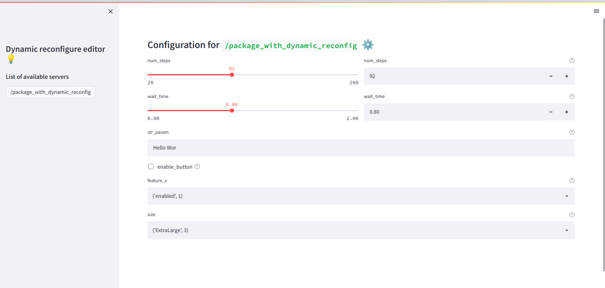

Moved to 

https://gitlab.com/seervision-public/dynamic-reconfigure-editor

---

## Web based dynamic reconfigure editor

[Dynamic reconfigure](http://wiki.ros.org/dynamic_reconfigure) is quite prevalent in ROS world as it allows change of parameters of ros nodes at runtime.

This small tool is inspired by two other projects that I found on github:
* [_web_dyn_reconf_](https://github.com/awesomebytes/web_dyn_reconf). This is no longer maintained and unfortunately doesn't work with the latest remi version.
* And [_Dynamic Reconfigure Web_](https://github.com/nobleo/dynamic-reconfigure-web) is made with Javascript and seems to work nicely. Unfortunately doesn't work with `enums`.

